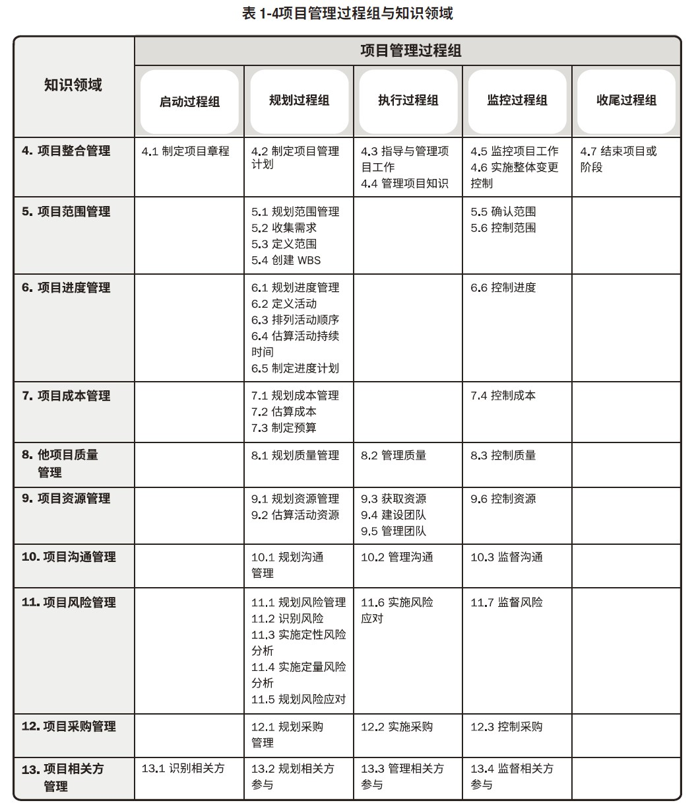
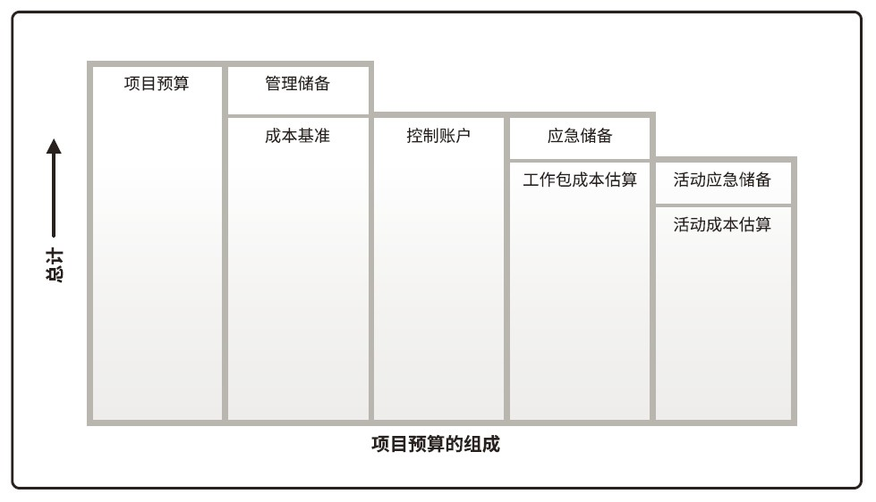
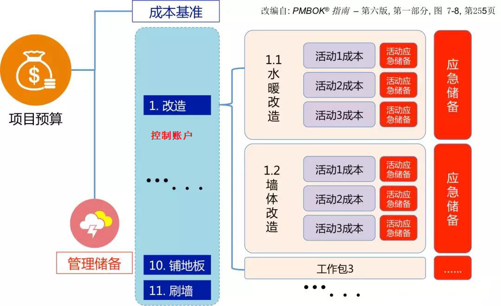
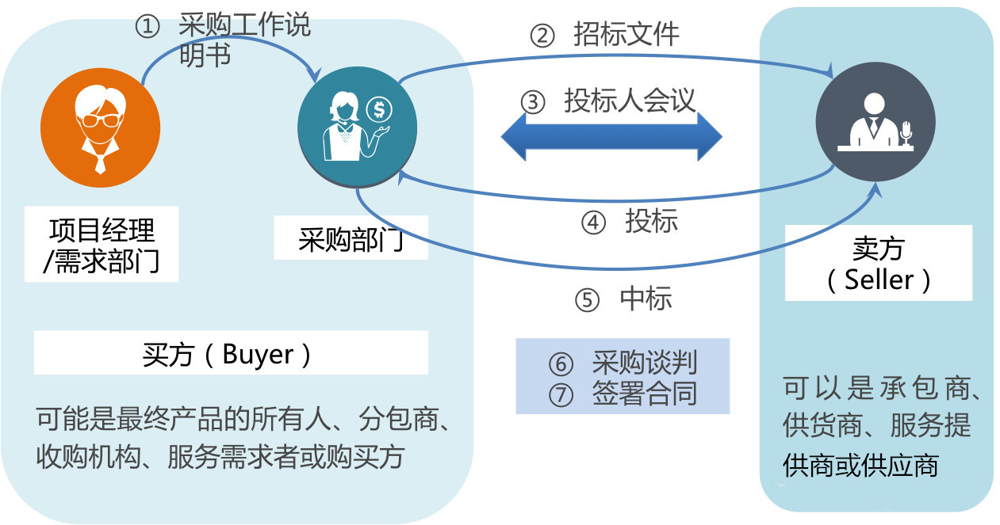
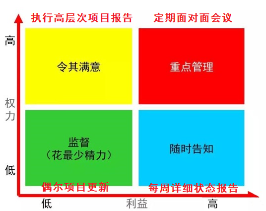
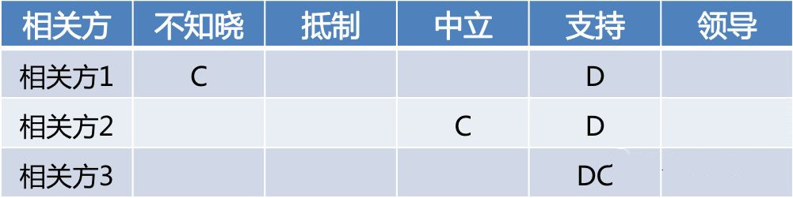
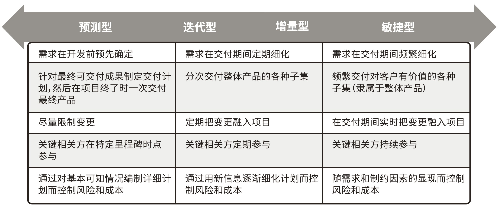

# PMP课程总结

**说明**：此文章为学习**陈迎秋**老师PMP课程的总结笔记，内容大多来源于陈老师文章。本文章仅供学习交流使用，引用转载时请写明原始作者为陈迎秋老师！

目录

- [第一章 引论](#第一章-引论)
- [第二章 项目运行环境](#第二章-项目运行环境)
- [第三章 项目经理的角色](#第三章-项目经理的角色)
- [第四章 项目整合管理⭐](#第四章-项目整合管理)
  - [4.1 制定项目章程](#41-制定项目章程)
  - [4.2 制定项目管理计划](#42-制定项目管理计划)
  - [4.3 指导与管理项目](#43-指导与管理项目)
  - [4.4 管理项目支持](#44-管理项目支持)
  - [4.5 监控项目工作](#45-监控项目工作)
  - [4.6 实施整体变更控制](46-实施整体变更控制)
  - [4.7 结束项目或阶段](47-结束项目或阶段)
- [第五章 项目范围管理](#第五章-项目范围管理)
  - [5.1 规划范围管理](#51-规划范围管理)
  - [5.2 收集需求](#52-收集需求)
  - [5.3 定义范围](#53-定义范围)
  - [5.4 创建WBS](#54-创建WBS)
  - [5.5 确认范围](#55-确认范围)
  - [5.6 控制范围](#56-控制范围)
- [第六章 项目进度管理](#第六章-项目进度管理)
  - [6.1 规划进度管理](#61-规划进度管理)
  - [6.2 定义活动](#62-定义活动)
  - [6.3 排列活动顺序](#63-排列活动顺序)
  - [6.4 估算活动持续时间](#64-估算活动持续时间)
  - [6.5 制定进度计划](#65-制定进度计划)
  - [6.6 控制进度](#66-控制进度)
- [第七章 项目成本管理](#第七章-项目成本管理)
  - [7.1 规划成本管理](#71-规划成本管理)
  - [7.2 估算成本](#72-估算成本)
  - [7.3 制定预算](#73-制定预算)
  - [7.4 控制成本](#74-控制成本)
- [第八章 项目质量管理⭐](#第八章-项目质量管理)
  - [8.1 规划质量管理](#81-规划质量管理)
  - [8.2 管理质量](#82-管理质量)
  - [8.3 控制质量](#83-控制质量)
- [第九章 项目资源管理](#第九章-项目资源管理)
- [第十章 项目沟通管理](#第十章-项目沟通管理)
  - [10.1 规划沟通管理](#101-规划沟通管理)
  - [10.2 管理沟通](#102-管理沟通)
  - [10.3 监督沟通](#103-监督沟通)
- [第十一章 项目风险管理⭐](#第十一章-项目风险管理)
- [第十二章 项目采购管理](#第十二章-项目采购管理)
  - [12.1 规划采购管理](#121-规划采购管理)
  - [12.2 实施采购](#122-实施采购)
  - [12.3 控制采购](#123-控制采购)
- [第十三章 项目相关方管理](#第十三章-项目相关方管理)
  - [13.1 识别相关方](#131-识别相关方)
  - [13.2 规划相关方参与](#132-规划相关方参与)
  - [13.3 管理相关方参与](#133-管理相关方参与)
  - [13.4 监督相关方参与](#134-监督相关方参与)
- [附三 PMP中的敏捷](#附三-pmp中的敏捷)
  - [敏捷特点](#敏捷特点)
  - [敏捷工具](#敏捷工具)



## 第一章 引论

【考点】PMI《道德与专业行为规范》：责任、尊重、公正、诚实  
【考点】生命周期类型：预测型、迭代型、增量型、适应型、混合型  

附：Stacey矩阵  


## 第二章 项目运行环境

【考点】组织过程资产（内在的，主动参考借鉴的）；事业环境因素（外在、被逼的）  
【考点】组织过程资产的包含：过程政策和程序、组织知识库（以往档案、历史经验教训等）  
【考点】常见组织结构类型：职能型、项目型、矩阵型（弱、平衡、强，PMBOK默认为强）  
【考点】PMO：支持型、控制型、指令型

## 第三章 项目经理的角色

【考点】四种项目经理的权利类型：正式权力（授予的正式职位）、专家权力（拥有知识经验）、奖惩权利、参考权利（被信任欣赏）

## 第四章 项目整合管理⭐

### 4.1 制定项目章程

**过程组**：启动过程组

启动过程组，包含：

- [4.1 制定项目章程](#41-制定项目章程)  
- [13.1 识别相关方](#131-识别相关方)  

启动前就有的：指南、标准、生命周期方法、各种模板等内容  
启动工作顺序：先有工作说明书，然后进行商业论证，然后编写章程，发起人授权项目经理  
启动没有的：没有详细计划，包括：详细的需求、范围、进度、成本基准、活动计划、人员分配

【考点】输入文件的内容及作用：商业文件、协议、项目工作说明书（SOW Statement Of Work）、事业环境因素、组织过程资产

`SOW`是对**成果**的描述，不是对过程的描述  
成果-产品范围  
过程-项目范围

工作说明书相关的顺序关系：  

1. 首先是得到工作说明书，明确项目的成果是什么；
2. 然后，得到商业论证，表明项目经济可行；
3. 最后，得到项目章程，获得授权；

`项目章程`：发起人授权项目经理，使用组织资源的授权书。

项目章程授权前的过程：先有协议或合同，工作说明书（SOW，要交付的成果），然后进行商业论证，确定值得投资后，编写项目章程，授权项目经理；

【考点】输出文件的内容及作用：项目章程、假设日志
【考点】工具的使用场景：专家判断（不靠谱，没数据找专家）、数据收集（访谈（一般针对高层）、头脑风暴（发散产生创意）、焦点小组（组织专家专项讨论））、人际关系与团队技能（冲突管理、引导（达成共识）、会议管理）、会议、名义小组（为头脑风暴投票排序）、德尔菲Delphi（匿名投票）

### 4.2 制定项目管理计划

**过程组**：规划过程组

**TODO**

### 4.3 指导与管理项目

**过程组**：执行过程组

### 4.4 管理项目支持

**过程组**：执行过程组

### 4.5 监控项目工作

**过程组**：监控过程组

### 4.6 实施整体变更控制

**过程组**：监控过程组

### 4.7 结束项目或阶段

**过程组**：收尾过程组

## 第五章 项目范围管理

### 5.1 规划范围管理

**过程组**：规划过程组

【考点】输出：`需求管理计划`、`范围管理计划`

`需求`：用户提出的期望  
`范围`：计划完成的工作

### 5.2 收集需求

**过程组**：规划过程组

【考点】工具：问卷调查、标杆对照、文件分析、投票、独裁、多标准决策分析、亲和图、思维导图、名义小组、观察与交谈、引导、用户故事、系统交互图、原型  

收集需求工具表

工具      | 解释
---------|---------
问卷调查  | 设计问题，快速收集大量被访者需求
标杆对照  | 和最佳实践或者竞争对手的对比
亲和图    | 对各种创意进行“分组”
思维导图  | 将多种信息“整合”在一张图中
名义小组  | 结构化的头脑风暴，投票最有用的创意，达成共识
市场分析  | 了解卖方的能力
JAD       | 适用于软件开发行业。这种研讨会注重把业务主题专家和开发团队集中在一起，以收集需求和改进软件开发过程
QFD       | 从收集客户需要（又称“客户声音”）开始，然后客观地对这些需要进行分类和排序，并为实现这些需要而设定目标。
用户故事  | 是对所需功能的简短文字描述，经常产生于需求研讨会。用户故事描述哪个相关方将从功能中受益（角色），他需要实现什么（目标），以及他期望获得什么利益（动机）。
系统交互图  | 对产品范围的可视化描绘，显示业务系统（过程、设备、计算机系统等）及其与人和其他系统（行动者）之间的交互方式
观察和交谈  | 直接到现场观察活动如何执行
原型法      | 原型法是指在实际制造预期产品之前，先造出该产品的模型，并据此征求对需求的早期反馈。原型包括微缩产品、计算机生成的二维和

【考点】输出：需求文件（业务需求、相关方需求、解决方案需求、过渡和就绪需求、项目需求、质量需求）、需求跟踪矩阵/需求追溯矩阵

### 5.3 定义范围

**过程组**：规划过程组

【考点】工具：系统分析（系统工程和产品分解）  
【考点】输出：`范围说明书`——明确哪些内容包含在项目中，而哪些不包含，包含有：产品范围描述、可交付成果、验收标准、除外责任

收集到的需求不一定都要包含在项目中，需要明确哪些在项目中包含

### 5.4 创建WBS

**过程组**：规划过程组

【考点】`WBS`（**W**ork **B**reakdown **S**tructure）是一个分解结构图，自上而下逐层分解（树状图）  
`控制账户`：是一种管理控制点，把范围、预算和进度加以整合，并与挣值相比较，以测量绩效；  
<a id="工作包"></a>
`工作包`：最低层级是带有独特标识号的工作包  
`规划包`：低于控制账户而高于工作包的工作分解结构组件，工作内容已知，但详细的进度活动未知  

【考点】`WBS词典`：是一个表格，针对WBS中的每个组件，详细描述可交付成果、活动和进度信息  
【考点】输出：`范围基准`——是经过批准的：范围说明书、WBS和WBS词典

### 5.5 确认范围

**过程组**：监控过程组

【考点】输入：`核实的可交付成果`  
【考点】工具：`检查`  
【考点】输出：`验收的可交付成果`  

相关流程：  
`4.3 指导与管理项目工作` -> *可交付成果* -> `8.3 控制质量` -> *核实的可交付成果* -> `5.5 确认范围` -> *验收的可交付成果*

**检查**针对**结果**  
**审计**针对**过程**

### 5.6 控制范围

**过程组**：监控过程组

【考点】范围蔓延和镀金  
`范围蔓延`：**未得到控制**的变更，项目范围以一种**不易察觉**的方式逐渐发生变化、等到发觉后、项目范围已经发生了实质性变化和重大偏离；通过严格执行变更控制过程来**避免**；  
`镀金`：项目团队**主动的**，出于好意而**额外增加**的内容；要**杜绝**

已经发生范围蔓延和镀金是问题，按照[问题管理流程](./TODO)处理

## 第六章 项目进度管理

[`工作包`](#工作包)分解为活动，排列活动顺序、估算活动时间，形成进度基准

`进度计划`经过**批准后**成为`进度基准`

`里程碑`：用于对客户或高级管理者汇报  
`甘特图`：用于管理项目，和管理层沟通  
`进度网络图`：用于团队执行任务

### 6.1 规划进度管理

**过程组**：规划过程组

### 6.2 定义活动

**过程组**：规划过程组

`活动`：特指工作包分解的可执行的工作

【考点】工具：滚动式规划（近期详细规划，远期的粗略规划，迭代进行）

### 6.3 排列活动顺序

**过程组**：规划过程组

【考点】工具  
`紧前关系绘图法（PDM）`  
四种依赖关系：  
完成-开始（FS）  
开始-开始（SS）：长辈动筷则开饭  
完成-完成（FF）：长辈离席则结束  
开始-完成（SF）：交接班

`确定和整合依赖关系`  
四种依赖关系：  
强制依赖  
选择依赖：先做哪个都可以  
外部依赖  
内部依赖  

`提前和滞后量`  
`提前`：提前量是相对于紧前活动，紧后活动可以提前的时间量；测试至少要在交付前几周开始  
`滞后`：滞后量是相对于紧前活动，紧后活动需要推迟的时间量；刷完墙要晾几天才做下一步装修

### 6.4 估算活动持续时间

**过程组**：规划过程组

【考点】估算方法  
`类比估算`：使用相似活动或项目的历史数据，来估算当前活动或项目的持续时间或成本。（粗略的估算方法，估算**成本较低**、**耗时较少**，**准确性**也较**低**）  
`参数估算`：基于历史数据和项目参数，使用某种**算法**来计算成本或持续时间。（准确性取决于**参数模型的成熟度**和**基础数据的可靠性**）  
`三点估算`：考虑估算中的不确定性和风险，可以提高持续时间估算的准确性（三角分布：估算 =(乐观+悲观+可能)/3；贝塔分布：估算 =(乐观+4可能+悲观)/6）  
`储备分析`：针对**已识别**的风险，规划**应急储备**；对**未知**的风险，规划**管理储备**  

### 6.5 制定进度计划

**过程组**：规划过程组


```
          6.2 定义活动
                ↓
  [活动清单][活动属性][里程碑清单]
      |___________________|
        ↓               ↓
6.3 排列活动顺序  6.4 估算活动持续时间
        ↓               ↓
   [进度网络图]    [持续时间估算]
      |____________________|
                ↓
         6.5 指定进度计划
                ↓
            [⭐进度基准]
```

【考点】工具  
`进度网络分析`  
**TODO** `关键路径法`  

`资源优化`  
`资源平衡`：为了在资源需求与资源供给之间取得平衡，根据资源制约因素对开始日期和完成日期进行调整的一种技术；解决资源分配过度，往往导致但不一定改变关键路径  
`资源平滑`：对进度模型中的活动进行调整，从而使项目资源需求不超过预定的资源限制的一种技术；主要解决资源使用总量超出规定的问题，  

`蒙特卡洛模拟`：反复模拟，使用概率分布，统计可能性  

`进度压缩`：快速跟进（并行开展活动，会有风险）、赶工（增加资源或者加长工作时间，会增加成本）  

`绩效审查`-百分比  
`偏差分析`-正负  
`趋势分析`-走势

### 6.6 控制进度

**过程组**：监控过程组

**TODO**

## 第七章 项目成本管理

### 7.1 规划成本管理

**过程组**：规划过程组

### 7.2 估算成本

**过程组**：规划过程组

【考点】估算工具：  
精准度：类别估算 < 参数估算 < 三点估算 < 自上而下 = 自下而上  
粗略估计（量级估计）：可研，精度在-25% ~ +75%  
确定性估计：项目实施前，精度在-5% ~ +10%

成本基准不是总数，而是在什么时候花多少钱，每个点的成本安排

### 7.3 制定预算

**过程组**：规划过程组

【考点】应急储备（已知未知风险），管理储备（未知风险）





**三大基准**
`范围基准`：范围说明书、WBS、WBS词典；  
`进度基准`：经过批准了的进度计划（表现为里程碑图、甘特图、进度网络图）；  
`成本基准`：是按照控制账户来分割的很多个成本+应急储备，不是项目的总预算；  

### 7.4 控制成本

**过程组**：监控过程组

**TODO**

## 第八章 项目质量管理⭐

质量管理重要工具技术：  
鱼骨图：因果图、why-why图、石川图；可能原因或根本原因  
帕累托图：80%主要原因，特殊直方图  
根本原因分析：5why，根本原因  
散点图：两个变量关系  
直方图：  
控制图：确定过程是否稳定；失控：超出控制上下限，或者连续七个点落在均值一侧  
质量成本：多投入一致性成本（预防成本，评价成本），避免非一致性成本（内部失败成本，外部失败成本）  

### 8.1 规划质量管理

**过程组**：规划过程组

【考点】工具：成本效益分析、质量成本、标杆对照、流程图、逻辑数据模型、矩阵图

### 8.2 管理质量

**过程组**：执行过程组

【考点】工具：根本原因分析、亲和图、因果图、直方图、散点图、问题解决

### 8.3 控制质量

**过程组**：监控过程组

【考点】工具：核对单、检查表、控制图

## 第九章 项目资源管理

**TODO**

## 第十章 项目沟通管理

【考点】沟通管理计划的用途、和相关方登记册、相关方参与计划的区别：  
`相关方登记册`：记录了相关方的基本信息，包括相关方的需求、相关方的分类等。记录了**有哪些人，有哪些期望**；  
`相关方参与计划`：调动个人或相关方参与的特定策略或方法，也就是如何管理相关方参与的策略等。规定人们**怎么参与**项目，如何满足期望；  
`沟通管理计划`：如何与各个相关方进行沟通，采取什么沟通方法等。**如何**与相关方**交流**信息；  

【考点】沟通方法：  
`交互式`：用于进行讨论、批准，互动式的沟通  
`推式`：单项发布信息，比如群发邮件等  
`拉式`：面临大量不确定的相关方时，用共享文件夹等形式，相关方主动来拉取信息  

### 10.1 规划沟通管理

**过程组**： 规划过程组

### 10.2 管理沟通

**过程组**：执行过程组

### 10.3 监督沟通

**过程组**：监控过程组

## 第十一章 项目风险管理⭐

**TODO**

## 第十二章 项目采购管理

项目采购管理，是指项目团队，在为客户完成项目的工作中，从第三方采购原材料、人员等的过程。也就是站在买方的视角，如何对外采购、管理卖方。



### 12.1 规划采购管理

**过程组**：规划过程组

记录项目采购决策、明确采购方法，及识别潜在卖方。

【考点】合同类型  
`总价合同`：已明**确定义需求**，且不会出现重大范围变更的情况下使用；买方风险最低  
*例如：一天差旅住宿交通800*

- `固定总价`：一口价；（确定的价格，不允许变动，风险最小）
- `总价加经济价格调整`：卖方履约期将跨越几年时间，或将以不同货币支付价款，针对条件变化，根据事先确定的方式调整价格；（合同周期较长，考虑通货膨胀、价格变化等因素而事先设置调整方式）
- `总价加激励费用`：为双方提供了一定的灵活性，允许一定的绩效偏离对事先既定成本、进度等指标给予财务奖励，设置价格上限；（允许一定偏差，根据绩效，进行激励，激励省钱，有上限；也可以激励质量、进度等）

`成本补偿合同`：工作范围会在合同执行期间**发生重大变更**；实报实销+利润  
*例如：差旅费凭发票实报实销，每天补助70*

- `成本加固定费用`：为卖方报销履行合同工作所发生的一切可列支成本，并向卖方支付一笔固定费用；（报销一切成本，另加一笔固定费用）
- `成本加奖励`：为卖方报销一切合法成本，但只有在卖方满足合同规定的、某些**笼统主观的绩效标准**的情况下，才向卖方支付大部分费用；（报销一切成本，奖励由买方主观决定）
- `成本加激励`。为卖方报销履行合同工作所发生的一切可列支成本，并在卖方**达到合同规定的绩效目标**时，向卖方支付预先确定的激励费用；（报销一切成本，费用按绩效来摊分，没有上限）

`工料合同`：在**无法快速编制出准确的工作说明书**的情况下扩充人员、聘用专家或寻求外部支持。开口合同  
*例如：临时聘请外部专家评审，一天1200*

```text
思考题：如果目标成本是100万，分担比例是8/2（买方8），费用为10万元，价格上限为130万。下列情况，买方需要总计支付卖方多少？

1. 成本加激励合同，实际成本为80万
  80 + 10 + (100 - 80) * 20% = 94 万
2. 成本加激励合同，实际成本为126万
  126 + 10 + (100 - 126) * 20 = 130.8 万
3. 总价加激励合同，实际成本为126万
  126 + 10 + (100 - 126) * 20 = 130.8 万 > 130 万
  总价有上限130万，最终买方支付130万

  花少了有结余要按比例分结余的
  花多了超正常要按比例分摊多花的
```

【考点】输出 `采购工作说明书`：定义要对外采购的项目范围，充分详细地描述拟采购的产品、服务或成果，以便潜在卖方确定是否有能力提供此类产品、服务或成果。项目经理想要对外采购的内容，**仅仅包括要采购的产品信息**。和卖方相关的信息，不包括在其中。

【考点】输出 `招标文件`：采购部门依据项目经理提供的采购SOW，用于向潜在卖方征求建议书。  
`信息邀请书`：需要卖方提供信息  
`报价邀请书`：需要卖方提供价格  
`建议邀请书`：需要卖方提供解决方案  

【考点】输出 `自制外购决策`：自己完成 OR 从外部渠道采购

### 12.2 实施采购

**过程组**：执行过程组

【考点】工具 `投标人会议`：**在发出招标文件之后，投标之前**，召集所有潜在卖方开的澄清会，体现公平、公正的原则。

【考点】工具 `采购谈判`：在中标之后，买方和中标的卖方之间，就合同的详细条款进行谈判，最终签署协议。

### 12.3 控制采购

**过程组**：监控过程组

【考点】工具 `采购审计`：对采购过程的结构化审查，审计采购**过程**是否合规。  
【考点】工具 `检查`：对承包商正在执行的工作进行检查，以确定可**交付成果**满足买方的要求。  
【考点】工具 `索赔管理`：如果买卖双方不能就变更补偿达成一致意见，或对变更是否发生存在分歧，此类有争议的变更称为索赔。首先本着**友好协商**的原则，其次采取替**代争议解决方法（ADR）**，最后可能引发**诉讼**等。

## 第十三章 项目相关方管理

狭义相关方：不含项目团队的相关方  

相关方 = 干系人，即：影响项目或被项目影响的人、团体  

### 13.1 识别相关方

**过程组**：启动过程组

【考点】工具：相关方分析  
【考点】相关方分类工具：



- 权利/利益方格  
- 权利/影响方格
- 相关方立方体、凸显模型（多个维度）  

【考点】输出：  
`相关方登记册`：记录了相关方的身份信息、评估信息、以及分类

### 13.2 规划相关方参与

**过程组**：规划过程组

【考点】工具：  
`相关方参与度评估矩阵`：用于将相关方当前参与水平与期望参与水平进行比较



### 13.3 管理相关方参与

**过程组**：执行过程组

### 13.4 监督相关方参与

**过程组**：监控过程组

## 附三 PMP中的敏捷

### 敏捷特点



敏捷宣言:

    个体和互动高于流程和工具
    工作的软件高于详尽的文档
    客户合作高于合同谈判
    响应变化高于遵循计划 

规划：小步快跑，降低影响  
执行：频繁交付，及时沟通  
过程：（与客户）密切合作，持续参与

### 敏捷工具

1. **用户故事**：对所需功能的简短文字描述，经常产生于需求研讨会。示例：作为XX角色，通过XX活动，希望得到XX价值
2. **每日站会**：项目团队和主要相关方就前一天的成绩和问题以及当天的工作计划展开讨论
3. **迭代燃尽图**：追踪迭代未完项中尚待完成的工作
4. **燃起图**：功能按计划的完成情况
5. **看板**：源自精益生产的术语，用于为整个团队提供直观的信息以便快速反应
