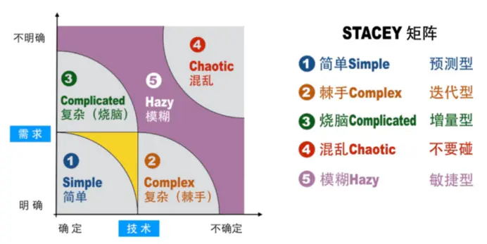

# PMP课程总结

**说明**：此文章为学习**陈迎秋**老师PMP课程的总结笔记，内容大多来源于陈老师文章。本文章仅供学习交流使用，引用转载时请写明原始作者为陈迎秋老师！

目录

- [第一章 引论](#第一章-引论)
- [第二章 项目运行环境](#第二章-项目运行环境)
- [第三章 项目经理的角色](#第三章-项目经理的角色)
- [第四章 项目整合管理⭐](#第四章-项目整合管理)
- [第五章 项目范围管理](#第五章-项目范围管理)
  - [5.1 规划范围管理](#51-规划范围管理)
  - [5.2 收集需求](#52-收集需求)
  - [5.3 定义范围](#55-定义范围)
  - [5.4 创建WBS](#54-创建WBS)
  - [5.5 确认范围](#55-确认范围)
  - [5.6 控制范围](#56-控制范围)
- [第六章 项目进度管理](#第六章-项目进度管理)
- [第七章 项目成本管理](#第七章-项目成本管理)
- [第八章 项目质量管理⭐](#第八章-项目质量管理)
- [第九章 项目资源管理](#第九章-项目资源管理)
- [第十章 项目沟通管理](#第十章-项目沟通管理)
- [第十一章 项目风险管理⭐](#第十一章-项目风险管理)
- [第十二章 项目采购管理](#第十二章-项目采购管理)
- [第十三章 项目相关方管理](#第十三章-项目相关方管理)
- [附三 PMP中的敏捷](#附三-pmp中的敏捷)
  - [敏捷特点](#敏捷特点)
  - [敏捷工具](#敏捷工具)

## 第一章 引论

【考点】PMI《道德与专业行为规范》：责任、尊重、公正、诚实  
【考点】生命周期类型：预测型、迭代型、增量型、适应型、混合型  

附：Stacey矩阵  

## 第二章 项目运行环境

【考点】组织过程资产（内在的，主动参考借鉴的）；事业环境因素（外在、被逼的）  
【考点】组织过程资产的包含：过程政策和程序、组织知识库（以往档案、历史经验教训等）  
【考点】常见组织结构类型：职能型、项目型、矩阵型（弱、平衡、强，PMBOK默认为强）  
【考点】PMO：支持型、控制型、指令型

## 第三章 项目经理的角色

【考点】四种项目经理的权利类型：正式权力（授予的正式职位）、专家权力（拥有知识经验）、奖惩权利、参考权利（被信任欣赏）

## 第四章 项目整合管理⭐

## 第五章 项目范围管理

### 5.1 规划范围管理

**过程组**：规划过程组

【考点】输出：`需求管理计划`、`范围管理计划`

`需求`：用户提出的期望  
`范围`：计划完成的工作

### 5.2 收集需求

**过程组**：规划过程组

【考点】工具：问卷调查、标杆对照、文件分析、投票、独裁、多标准决策分析、亲和图、思维导图、名义小组、观察与交谈、引导、用户故事、系统交互图、原型  

收集需求工具表

工具      | 解释
---------|---------
问卷调查  | 设计问题，快速收集大量被访者需求
标杆对照  | 和最佳实践或者竞争对手的对比
亲和图    | 对各种创意进行“分组”
思维导图  | 将多种信息“整合”在一张图中
名义小组  | 结构化的头脑风暴，投票最有用的创意，达成共识
市场分析  | 了解卖方的能力
JAD       | 适用于软件开发行业。这种研讨会注重把业务主题专家和开发团队集中在一起，以收集需求和改进软件开发过程
QFD       | 从收集客户需要（又称“客户声音”）开始，然后客观地对这些需要进行分类和排序，并为实现这些需要而设定目标。
用户故事  | 是对所需功能的简短文字描述，经常产生于需求研讨会。用户故事描述哪个相关方将从功能中受益（角色），他需要实现什么（目标），以及他期望获得什么利益（动机）。
系统交互图  | 对产品范围的可视化描绘，显示业务系统（过程、设备、计算机系统等）及其与人和其他系统（行动者）之间的交互方式
观察和交谈  | 直接到现场观察活动如何执行
原型法      | 原型法是指在实际制造预期产品之前，先造出该产品的模型，并据此征求对需求的早期反馈。原型包括微缩产品、计算机生成的二维和

【考点】输出：需求文件（业务需求、相关方需求、解决方案需求、过渡和就绪需求、项目需求、质量需求）、需求跟踪矩阵/需求追溯矩阵

### 5.3 定义范围

**过程组**：规划过程组

【考点】工具：系统分析（系统工程和产品分解）  
【考点】输出：`范围说明书`——明确哪些内容包含在项目中，而哪些不包含，包含有：产品范围描述、可交付成果、验收标准、除外责任

收集到的需求不一定都要包含在项目中，需要明确哪些在项目中包含

### 5.4 创建WBS

**过程组**：规划过程组

【考点】`WBS`（**W**ork **B**reakdown **S**tructure）是一个分解结构图，自上而下逐层分解（树状图）  
`控制账户`：是一种管理控制点，把范围、预算和进度加以整合，并与挣值相比较，以测量绩效；  
`工作包`：最低层级是带有独特标识号的工作包
`规划包`：低于控制账户而高于工作包的工作分解结构组件，工作内容已知，但详细的进度活动未知  

【考点】`WBS词典`：是一个表格，针对WBS中的每个组件，详细描述可交付成果、活动和进度信息  
【考点】输出：`范围基准`——是经过批准的：范围说明书、WBS和WBS词典

### 5.5 确认范围

**过程组**：监控过程组

【考点】输入：`核实的可交付成果`  
【考点】工具：`检查`  
【考点】输出：`验收的可交付成果`  

相关流程：  
`4.3 指导与管理项目工作` -> *可交付成果* -> `8.3 控制质量` -> *核实的可交付成果* -> `5.5 确认范围` -> *验收的可交付成果*

**检查**针对**结果**  
**审计**针对**过程**

### 5.6 控制范围

**过程组**：监控过程组

【考点】范围蔓延和镀金  
`范围蔓延`：**未得到控制**的变更，项目范围以一种**不易察觉**的方式逐渐发生变化、等到发觉后、项目范围已经发生了实质性变化和重大偏离；通过严格执行变更控制过程来**避免**；  
`镀金`：项目团队**主动的**，出于好意而**额外增加**的内容；要**杜绝**

已经发生范围蔓延和镀金是问题，按照[问题管理流程](./TODO)处理

## 第六章 项目进度管理

## 第七章 项目成本管理

## 第八章 项目质量管理⭐

## 第九章 项目资源管理

## 第十章 项目沟通管理

## 第十一章 项目风险管理⭐

## 第十二章 项目采购管理

## 第十三章 项目相关方管理

## 附三 PMP中的敏捷

### 敏捷特点

敏捷宣言:

    个体和互动高于流程和工具
    工作的软件高于详尽的文档
    客户合作高于合同谈判
    响应变化高于遵循计划 

规划：小步快跑，降低影响  
执行：频繁交付，及时沟通  
过程：（与客户）密切合作，持续参与

### 敏捷工具

1. **用户故事**：对所需功能的简短文字描述，经常产生于需求研讨会。示例：作为XX角色，通过XX活动，希望得到XX价值
2. **每日站会**：项目团队和主要相关方就前一天的成绩和问题以及当天的工作计划展开讨论
3. **迭代燃尽图**：追踪迭代未完项中尚待完成的工作
4. **燃起图**：功能按计划的完成情况
5. **看板**：源自精益生产的术语，用于为整个团队提供直观的信息以便快速反应
